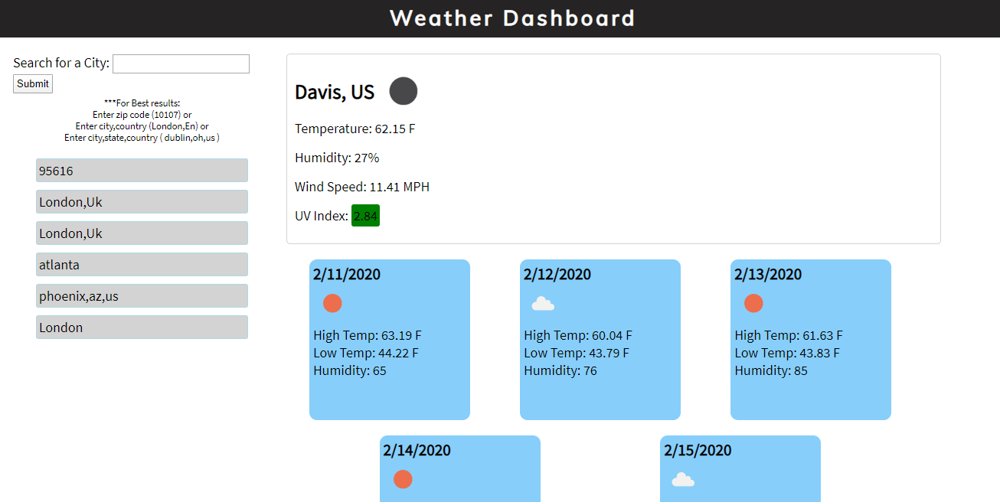

# weather-dashboard

A weather app that uses the OpenWeather api to get the weather for the chosen city. It shows both current and 5 day forecasts. It uses 3 apis from OpenWeatherMap. One to get current weather, 5 day forecast and uv index of the current weather.

## Further Improvements

Local storage is not bounded for this website. The search history will keep growing as the user inputs locations.
Times are converted to local time of the browser to determine what day the data is for since the data is UTC time but they should be converted to the local time of the city that is inputted.

https://wbrink.github.io/weather-dashboard

